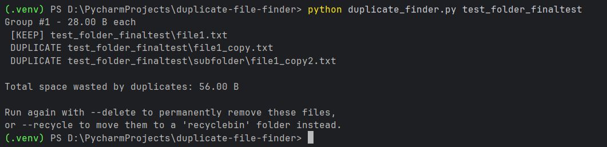

# Duplicate File Finder & Storage Cleanup Tool

A Python-based duplicate file detector with both a command-line interface
and a graphical desktop app, built to find and safely clean up redundant
files eating into storage space.

Files are compared by actual content (via MD5/SHA1/SHA256 hashing), not just
filename, so it catches duplicates even when they've been renamed or copied
into different folders.

The tool uses a two-phase detection strategy — first grouping files by size,
then only hashing files that share a size with another file — to avoid
unnecessarily hashing every single file in large directories, keeping scans
fast even across tens of thousands of files.

Cleanup can be done two ways: permanently deleting duplicates, or moving
them to a local recycle bin folder first, so nothing is lost if the tool
ever flags something unexpectedly.

The command-line version (`duplicate_finder.py`) is built for automation and
scripting — usable in scheduled jobs or piped into other tools. The GUI
version (`duplicate_finder_gui.py`) wraps the same core logic in a Tkinter
desktop app with a folder picker, sortable results (biggest space-wasters
first), and single-click file selection with a detail panel — designed for
anyone who'd rather not touch a terminal. Both share one core detection
engine, so there's a single source of truth for the actual duplicate-finding
logic.

## Features

- **Recursive directory scanning** — finds duplicates in nested subfolders too
- **Content-based detection** — uses MD5/SHA1/SHA256 hashing, so it catches
  duplicates even if filenames differ
- **Size pre-filtering** — skips hashing files that couldn't possibly match,
  making large scans much faster
- **Human-readable reports** — shows duplicate groups sorted by wasted
  space, biggest first
- **Two safe cleanup modes** — permanently delete, or move to a local
  `recyclebin` folder for easy recovery
- **Background scanning (GUI)** — scans run on a separate thread so the
  window stays responsive during large scans
- **Scan logging** — save results to `.csv` or `.txt` for a record of every
  scan
- **CLI tool** — built with `argparse`, ideal for scripting and automation
- **GUI app** — Tkinter desktop app with folder picker, sortable results,
  and a detail panel showing full file paths on click
- **Single core engine** — both CLI and GUI import their duplicate-finding
  logic from the same source, so there's no duplicated code between them

## Tech Stack

- Python 3
- `os` — directory traversal and file system operations
- `hashlib` — file content hashing (MD5 / SHA1 / SHA256)
- `argparse` — command-line interface
- `shutil` — safely moving files to the recycle bin folder
- `csv` / `datetime` — scan logging with timestamps
- `tkinter` — graphical desktop interface
- `threading` — keeps the GUI responsive during long scans
- `collections.defaultdict` — grouping files efficiently

## Project Structure

duplicate_finder.py # Core detection logic + CLI tool
duplicate_finder_gui.py # Tkinter GUI, imports core logic from duplicate_finder.py

No external dependencies — everything runs with a standard Python 3
installation.

## Installation

```bash
git clone https://github.com/sonalstack330/duplicate-file-finder.git
cd duplicate-file-finder
```

## Usage — Command Line

**Scan a folder and see a report (no files touched):**
```bash
python duplicate_finder.py "C:/path/to/folder"
```

**Scan and permanently delete duplicates:**
```bash
python duplicate_finder.py "C:/path/to/folder" --delete
```

**Scan and move duplicates to a local recycle bin instead:**
```bash
python duplicate_finder.py "C:/path/to/folder" --recycle
```

**Use a stronger hash algorithm:**
```bash
python duplicate_finder.py "C:/path/to/folder" --hash sha256
```

**Ignore small files (e.g., skip anything under 1KB):**
```bash
python duplicate_finder.py "C:/path/to/folder" --min-size 1024
```

**Save scan results to a log file:**
```bash
python duplicate_finder.py "C:/path/to/folder" --log csv
```

**See all available options:**
```bash
python duplicate_finder.py --help
```

## Usage — GUI

```bash
python duplicate_finder_gui.py
```

1. Click **Browse...** and select a folder to scan
2. Click **Scan** — duplicate groups appear sorted by wasted space, biggest first
3. Click any file to see its full path in the detail panel below the list
4. Select a duplicate and choose **Move Selected to Recyclebin** (safe, reversible)
   or **Delete Selected Permanently** (irreversible) use with caution

## Example Output (CLI)



## How It Works

1. Walks the target directory recursively, grouping files by size
2. Only files sharing a size with another file get hashed (avoids unnecessary
   hashing of clearly-unique files)
3. Files with identical hashes are grouped as duplicates
4. Groups are sorted by wasted space, so the biggest storage wins show up first
5. One file per group is kept; the rest are flagged as redundant
6. On confirmation, redundant files are deleted or moved to `recyclebin`, and
   space freed is reported

## Recovering Files (GUI)

If you used **"Move Selected to RecycleBin,"** deleted files are safely
stored in the `recycleBin/` folder inside the project directory — not
actually removed. To restore a file, manually move it back to its original
location.

**"Delete Selected Permanently" cannot be undone.** Files removed this way
are not recoverable through this tool. Prefer "Move Selected to RecycleBin"
unless you are certain you want to permanently delete a file.

## Note on Logging

CSV/TXT scan logging (`--log`) is currently available in the CLI tool only.
The GUI is focused on interactive review and cleanup; for a saved audit
trail of a scan, use `duplicate_finder.py` with `--log csv` or `--log txt`.

## Disclaimer

Permanent deletion (`--delete`) is irreversible. The recycle bin mode
(`--recycle`) is the safer default — files are moved, not destroyed, and can
be manually restored. Always review the report before confirming any
cleanup action.


